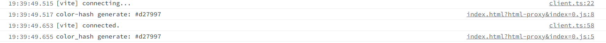

## color_hash
- color_hash is clone from [color-hash](https://github.com/zenozeng/color-hash)'s feature which a string mapping a color.
- color_hash is a pure function.
- color_hash is rust wasm version.
- color_hash use litter functionial trick.
- rust wasm version color_hash can't not customize ,unless modify source code and compile.
- npm location [@wingdust/color_hash](https://www.npmjs.com/package/@wingdust/color_hash)

## for Rustacean
- [color_hash](https://crates.io/crates/color_hash) actually also can use in rust code.

## test
- `npm install`
- `npm run dev` you can see in browser

- test code in index.html

